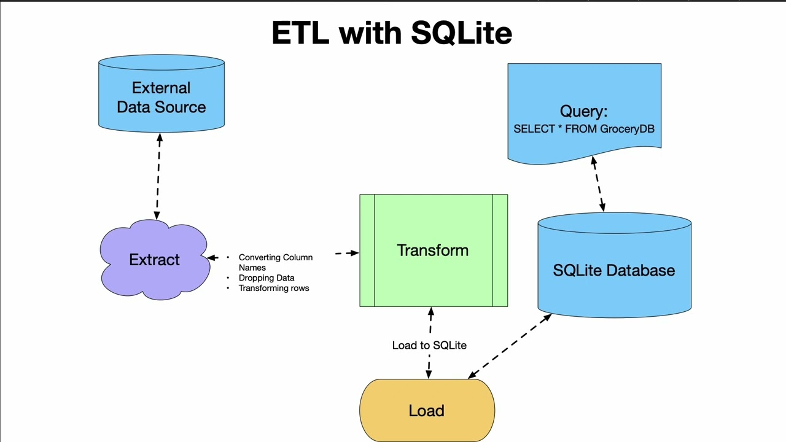
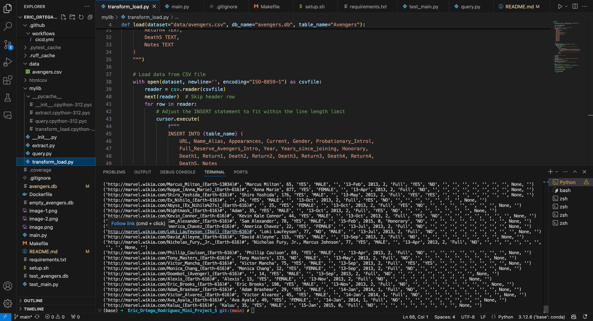

[](https://github.com/nogibjj/Eric_Ortega_Rodriguez_Mini_Project_5/actions/workflows/cicd.yml)
# Eric Ortega Rodriguez Mini Project 5

## Overview

This project is part of our data engineering coursework that covers data operations involving SQL databases and Python. The focus of the project is to demonstrate the ability to connect to a SQL database, perform **CRUD** (Create, Read, Update, Delete) operations, and perform SQL queries. The project also includes a CI/CD pipeline to ensure that the operations work as expected, and it logs the results of successful database operations. The deliverables for the assignment are the Python script and a screenshot of my successful database operations (seen below). I used the avengers dataset which be found [here.](https://github.com/fivethirtyeight/data/tree/refs/heads/master/avengers)



## Requirements
- Connect to a SQL database
- Perform CRUD operations
- Write at least two different SQL queries

## Project Breakdown

```

├── .devcontainer/               # Development container configuration for VS Code
│   ├── devcontainer.json        # Defines the development container settings
│   └── Dockerfile               # Dockerfile used to set up the container
│
├── .github/
│   └── workflows/
│       └── cicd.yml             # GitHub Actions workflow for Continuous Integration/Delivery (CI/CD)
│
├── data/
│   └── avengers.csv             # Dataset containing Avengers information
│
├── mylib/                       # Custom Python library
│   ├── __pycache__/             # Compiled Python files
│   │   ├── __init__.cpython-312.pyc
│   │   ├── extract.cpython-312.pyc
│   │   ├── query.cpython-312.pyc
│   │   └── transform_load.cpython-312.pyc
│   ├── __init__.py              # Marks this directory as a package
│   ├── extract.py               # Script to extract data
│   ├── query.py                 # Script to query the extracted data
│   └── transform_load.py        # Script for transforming and loading data
│
├── .gitignore                   # Git ignore file for excluding specific files from version control
├── avengers.db                  # SQLite database created from the transformed data
├── Dockerfile                   # Dockerfile for the main project container
├── image.png                    # Project image (could be used in README)
├── main.py                      # Main script to run the pipeline
├── Makefile                     # File containing commands to set up and run the project
├── README.md                    # This file, the project overview
├── requirements.txt             # Python dependencies
├── setup.sh                     # Shell script to set up the project environment
└── test_main.py                 # Unit tests for the main pipeline

```

## Deliverables 
### 1. Python Script

### 2. Screenshots (See Below)



## References
https://github.com/nogibjj/sqlite-lab